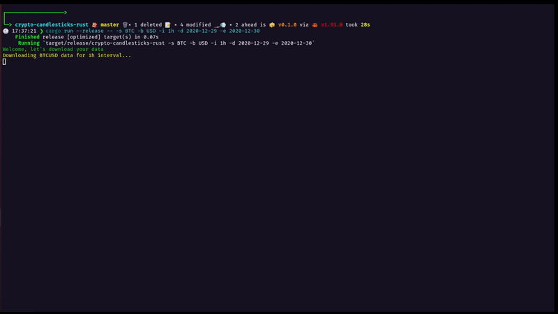

# crypto-candlesticks-rust 📈

---

The goal behind this project is to facilitate downloading cryptocurrency candlestick data fast & simple.
Currently only the [Bitfinex](https://www.bitfinex.com/) exchange is supported with more to come in future releases.

I created this project to port my python package [crypto-candlesticks](https://pypi.org/project/crypto-candlesticks/) as an exercise to learn Rust.

Once the data is downloaded, it will be converted and stored in a `.csv and .sqlite3` for convenient analysis.
The data will include the `Open, High, Low, Close` of the candles and the `volume` during the `interval` and its `timestamp`.

#### Example output for CSV ✅

| Open     | Close     | High   | Low       | Volume    | Ticker  | Date       | Time     |
| -------- | --------- | ------ | --------- | --------- | ------- | ---------- | -------- |
| 7203     | 7201      | 7203.7 | 7200.1    | 9.404174  | BTC/USD | 12/31/2019 | 16:00:00 |
| 7201     | 7223.6    | 7223.6 | 7201      | 7.9037398 | BTC/USD | 12/31/2019 | 16:01:00 |
| 7224.4   | 7225      | 7225.5 | 7224.4    | 0.4799298 | BTC/USD | 12/31/2019 | 16:02:00 |
| 7224.981 | 7225.9    | 7225.9 | 7224.981  | 0.9294573 | BTC/USD | 12/31/2019 | 16:03:00 |
| 7225.862 | 7225.7295 | 7225.9 | 7225.7295 | 0.2913202 | BTC/USD | 12/31/2019 | 16:04:00 |
| 7225.7   | 7225.8673 | 7225.9 | 7225.2973 | 1.0319704 | BTC/USD | 12/31/2019 | 16:05:00 |

#### Example output for SQL (the timestamp is shown in milliseconds) ✅

| ID  | Timestamp       | Open          | Close         | High          | Low           | Volume     | Ticker | Interval |
| --- | --------------- | ------------- | ------------- | ------------- | ------------- | ---------- | ------ | -------- |
| 1   | 1577868000000.0 | 7205.7        | 7205.8        | 7205.8        | 7205.7        | 0.07137942 | BTCUSD | 1m       |
| 2   | 1577867940000.0 | 7205.70155305 | 7205.8        | 7205.8        | 7205.70155305 | 0.035      | BTCUSD | 1m       |
| 3   | 1577867880000.0 | 7205.7        | 7205.70155305 | 7205.70155305 | 7205.7        | 0.025      | BTCUSD | 1m       |
| 4   | 1577867820000.0 | 7205.75299748 | 7205.75299748 | 7205.75299748 | 7205.7        | 0.075      | BTCUSD | 1m       |
| 5   | 1577867760000.0 | 7205.75299748 | 7205.2        | 7206.3        | 7205.2        | 0.005      | BTCUSD | 1m       |
| 6   | 1577867700000.0 | 7205.2        | 7205.2        | 7205.2        | 7205.2        | 4.5802     | BTCUSD | 1m       |

##### Contributing

Feel free to open an [issue](https://github.com/Corfucinas/crypto-candlesticks-rust/issues/new) or [pull request](https://github.com/Corfucinas/crypto-candlesticks-rust/pulls).

##### Buy me a coffee

ETH: 0x06Acb31587a96808158BdEd07e53668d8ce94cFE
